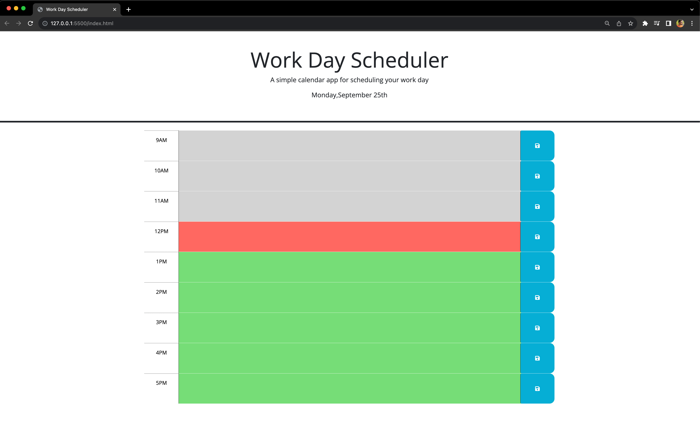
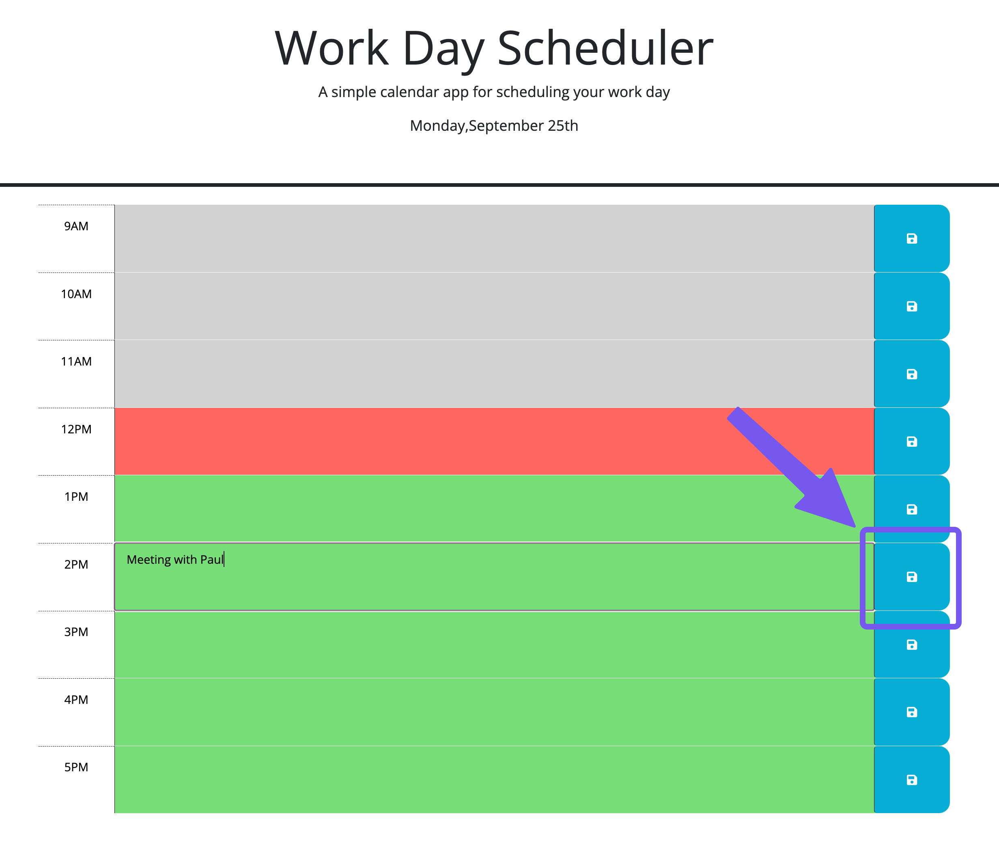

# Work-Day-Scheduler

## Description

This webpage serves as a simple calendar app for scheduling your work day.

## Installation

N/A

## Usage

When you first load the page you are greated with current day date on top and time-blocks from 9Am to 5PM. The current hour time-block will be displayed in red background colour. The past hours in grey and the next hours to come in green.

You can type in the time-block to add an event and save them using the blue button to the right side corresponding to the time-block you entered the event.

Once you have saved the event, even if you reload the page the saved events will be persistent unless you edit and save them again.

## Credits

N/A

## License

MIT License

## Deployed applicatin link

https://delve-in.github.io/Work-Day-Scheduler/